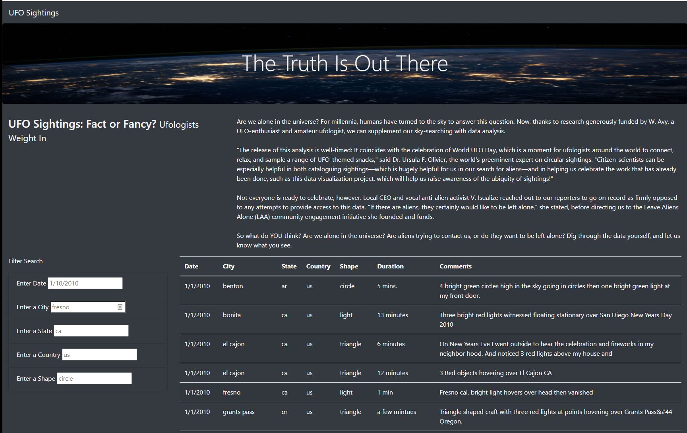

# UFO sightings info web app

## Overview of Project:
In this project, we use JavaScript to create an interactive web page that dynamically display UFO sightings information based user provided search criteria.

## Results:
Using HTML and JavaScript, we created a web page that can dynamically display UFO sightings information based on users provided search criteria.  We start by displaying UFO sightings based on our entire database.  As users enter their search criteria in one of the five options (Date, City, State, Country, Shape), the sightings information displays in the table will be dynamically filtered.

## Summary:
One draw back with our current design is that our selection criteria inputs are very precise, for example a specific date.  This leads to no result displayed in many instance.

We recommend the following improvements:

* Instead of a specific date, use "since" the "date" user enters.  This will help users narrow their search yet not elimitate too many options.

* Since all except two sightings are from US (with the two exception from CA), we can consider elimiating the "Country" search option.  This should streamline the searches for our users.  

